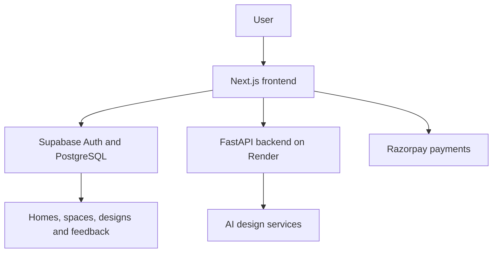

# ZYLO — AI-Powered Interior Design Platform

ZYLO is a full-stack AI interior-design platform that helps users transform real rooms into practical redesign plans. Users can organize an entire home into individual spaces, upload room photos, choose a preferred style and budget, protect items that must remain, and receive actionable design recommendations.

**Live application:** [zylo-zylo12.vercel.app](https://zylo-zylo12.vercel.app)

## Why ZYLO?

Most interior-design generators focus only on producing attractive images. ZYLO focuses on the decisions behind a redesign: what to keep, what to change, where to spend first, and how to maintain one visual language across an entire home.

## Key Features

- Secure user authentication and password recovery
- Multiple homes and spaces under one account
- Support for living rooms, bedrooms, kitchens, balconies, bathrooms and more
- Room-image upload and preview
- Modern, Minimalist, Scandinavian, Industrial and Boho styles
- Light Refresh, Balanced Redesign and Major Makeover modes
- Custom Keep, Change and additional-requirement controls
- AI-generated practical interior-design plans
- Smart budget allocation for furniture, materials, lighting, decor and contingency
- Free visual-instruction preview before paid image generation
- AI redesign variations with user feedback for the next result
- Before-and-after comparison
- Interactive design-driven 3D room preview
- Clickable design history
- Correct/Incorrect feedback collection for measuring recommendation usefulness
- Credit-based AI generation and Razorpay payment support
- Loading progress, 90-second timeout and retry handling for sleeping cloud services

## Technology Stack

| Layer | Technologies |
|---|---|
| Frontend | Next.js, React, JavaScript, CSS |
| Authentication and database | Supabase Auth, PostgreSQL, Row Level Security |
| Backend | Python, FastAPI |
| AI and image generation | Interior-style intelligence, Stability AI integration |
| 3D experience | React-based interactive 3D components |
| Payments | Razorpay |
| Frontend hosting | Vercel |
| Backend hosting | Render |
| Version control | Git and GitHub |

## System Architecture



## Typical User Flow

1. Create an account or log in.
2. Create a home and add its rooms or outdoor spaces.
3. Upload a clear photograph of a space.
4. Choose a target style, budget and redesign intensity.
5. Specify what must stay and what should change.
6. Build a practical design plan.
7. Preview the visual instructions or generate an AI redesign.
8. Explore the design in 3D and save it to design history.
9. Mark the plan as Correct or Incorrect to help improve ZYLO.

## Repository Structure

```text
ZYLO/
├── ai/                 # AI-related resources and model files
├── backend/            # FastAPI backend and integrations
├── frontend/           # Next.js web application
│   ├── public/
│   └── src/
│       ├── app/        # Routes and pages
│       ├── components/ # Reusable UI and 3D components
│       └── lib/        # Shared frontend utilities
├── supabase/           # Database configuration and SQL resources
└── vercel.json         # Vercel configuration
```

## Run Locally

### Prerequisites

- Node.js and npm
- Python 3.10 or newer
- A Supabase project
- Required third-party API credentials

### Frontend

```bash
cd frontend
npm install
npm run dev
```

Open `http://localhost:3000`.

### Backend

```bash
cd backend
python -m venv .venv
```

Activate the environment:

```bash
# Windows
.venv\Scripts\activate

# macOS/Linux
source .venv/bin/activate
```

Install the backend dependencies and start the API using the command configured by the backend project.

## Environment Variables

Create local environment files from the provided examples. Depending on the enabled features, the project requires values for:

- Supabase project URL and public key
- Backend API URL
- AI generation provider
- Razorpay public and secret keys
- Payment webhook verification

Never commit real passwords, service-role keys, API secrets or payment secrets to GitHub.

## Security

- Supabase Row Level Security protects user-owned data.
- Users can access only their own homes, spaces, designs and feedback.
- Sensitive payment and AI credentials remain on the server.
- Payment credits are updated through verified server-side workflows.

## Current Deployment Note

ZYLO uses free cloud hosting during its initial validation stage. A sleeping backend may make the first AI request take up to 90 seconds. The interface displays progress, prevents repeated submissions and provides retry handling.

## Roadmap

- Test paid AI redesign generation when provider credits are available
- Add more interior styles and space-specific recommendations
- Improve model accuracy with a larger, balanced dataset
- Add product and furniture recommendations
- Expand analytics using verified tester feedback
- Improve mobile accessibility and 3D performance

## Project Status

ZYLO is publicly deployed and under active development. Authentication, home and space management, design planning, budgeting, design history, 3D preview and feedback collection are available. Paid AI image generation depends on provider credits.

## Creator

Developed by **Kalaivani.K, B.Tech Information Technology student, as a portfolio-grade AI and full-stack product.

## License

This project is intended for educational, portfolio and product-development purposes. Add a formal licence before accepting external contributions or commercial reuse.
